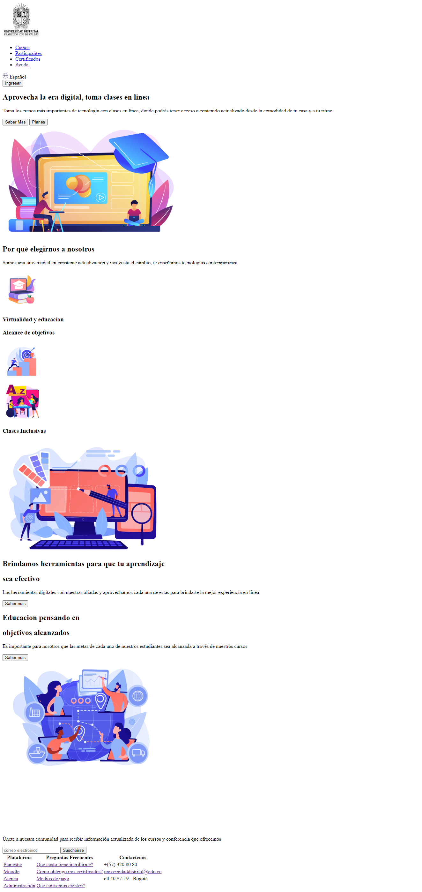
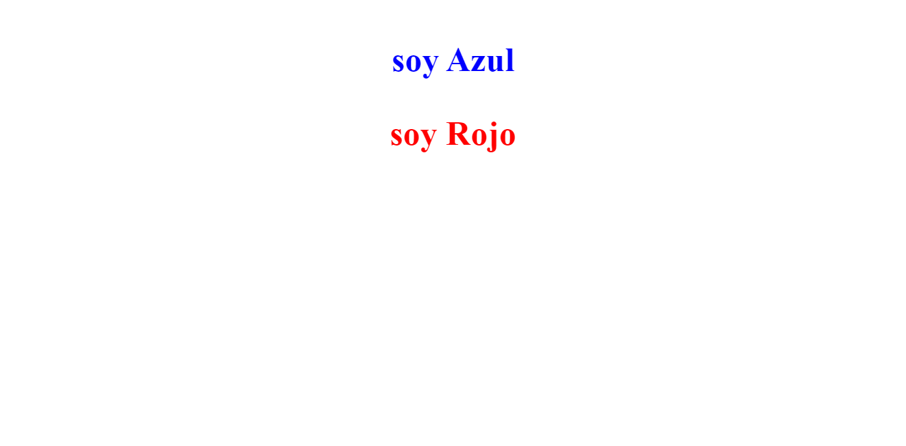
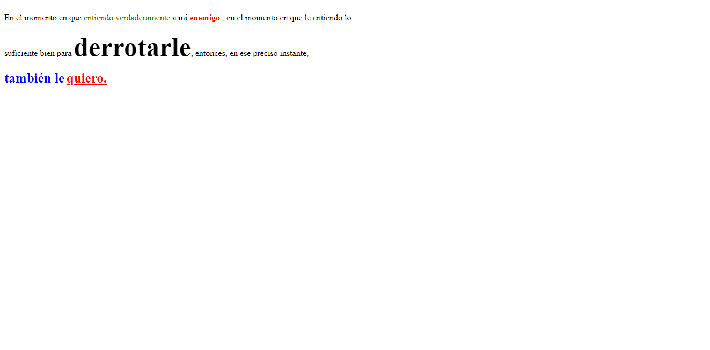

<h1>Taller 9 luis Florez</h1>

<h2>Informacion</h2>

Curso: Full Stack Basico - Grupo 1

Profesor: Cristian Patiño

<h2>Punto 1: link de figma</h2>
<a href="https://www.figma.com/file/L2NbCLR6H6v6sDjowYNtrS/Mockup-atenea-luis-florez?type=design&node-id=0%3A1&t=JxuLtdT4IbYMdz6d-1" target="_blank">link de figma</a>

 
<a href="https://slobenzo.github.io/taller-9-full-stack/">link pagina</a>

<h2>Punto 2: HTML</h2>

<h2>Punto 3: CSS</h2>

<h2>Punto 4: CSS</h2>

<h2>Punto 5: CSS</h2>
